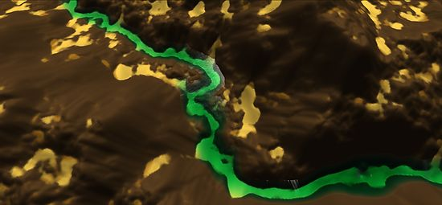

# Interactive-Erosion

This project is based on the excellent article Interactive Terrain Modeling Using Hydraulic Erosion. The Authors were also kind enough to publish the code in ShaderX7 which is what a lot of this Unity project is based on. I have made some changes and left some things out. 

The idea behind this project is to erode a height map through a series of natural processes to help create a more realistic height map. Three processes are applied to the height map each frame and can be classed as force-based erosion, dissolution-based erosion and material slippage. All of these processes are carried out on the GPU. The height map can be represented by a series of layers (4, one for each RGBA channel) and each can have different erosion settings applied to it. The lower layer represents the base rock layer and the top layer represents soft soil/sand were any sediment is deposited.

